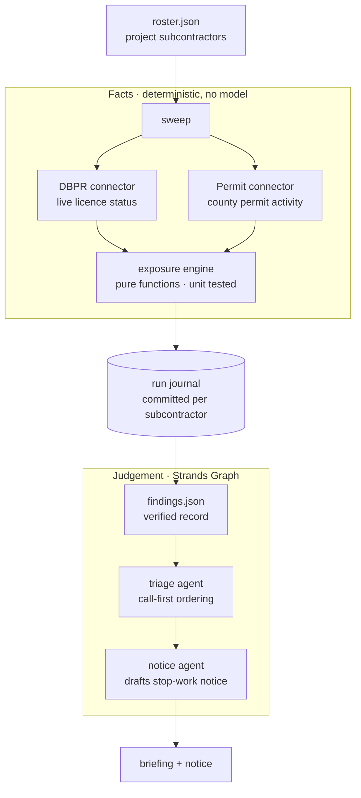

# Proto

**Continuous subcontractor licence verification for construction projects.**

Verified in January. Still valid in September?

---

## The problem

A general contractor runs twenty to forty subcontractors on a project, each working
under a qualifying agent's state licence. Most firms verify those licences **once**,
at onboarding, file the certificates, and move on. That leaves the contractor exposed
for the rest of the project.

A licence can go delinquent in month seven of a fourteen-month job. Nobody is
notified. The subcontractor keeps working and keeps getting paid.

When it surfaces, the exposure lands on the general contractor: contracts with an
unlicensed contractor are void and unenforceable, liens cannot be filed, general
liability cover may be voided for work performed in violation of licensing law, and
under OSHA's multi-employer policy the GC is the controlling employer.

A calendar reminder knows one date somebody typed in. **Proto reads the registry of
record.**

## What it does

Proto re-verifies an entire project roster against the live Florida DBPR registry,
cross-references county permit activity, ranks by what is genuinely dangerous, and
drafts the notice.

The ranking is the point. Real output, live data, nothing seeded:

```
■ CRITICAL  3JW CONSTRUCTION, INC.
   CCC1332414 · Certified Roofing Contractor
   → Licence status is SUSPENDED (registry reads "Suspended, Active").
   → 1 permit pulled under this licence this year, most recently 2026-02-26.
   → Work is in progress on a licence that cannot lawfully support it.
   action: Stop work and withhold the next draw until the licence is reinstated.

· ok  24 HR AIR SERVICE INC
   CAC1814637 · Certified Air Conditioning Contractor
   → 5 permits on record, the last 8 months ago (2025-12-22) — work from that job
     may still be open. Licence is in good standing, so this is context, not exposure.

4 of 16 need attention.
```

Both subcontractors have open work. Only one is a finding. A date-based reminder
cannot tell them apart.

## Architecture



**The split is deliberate.** Connectors and the exposure engine establish facts
deterministically. The agent layer receives findings that are already true and only
decides ordering and drafts prose. Nothing downstream can alter a status, a date, or
a permit count.

Every reason Proto gives is recomputed from the record in front of it, so an
explanation cannot drift from its evidence. A language model narrating its own
reasoning about liability is the failure mode this project exists to avoid.

## Resumability

A sweep is a long sequence of calls against two public services. If it dies at
subcontractor nine, restarting from one means thirty more requests at a government
portal to re-learn what was already known — and on a large roster that is why the
check quietly stops being run at all.

Each subcontractor is committed to a run journal the moment it is verified, written
to a temporary file and renamed so a kill mid-write leaves the previous good journal
intact. A resumed run skips what is settled and continues from the first unsettled
name.

```
$ PROTO_CRASH_AFTER=5 npm run sweep
  checking CCC1327792 … CRITICAL
  ...
  [simulated crash after 5 verified — journal holds 5]

$ npm run sweep
  resuming — 5 of 16 already verified, picking up from there
  CCC1327792 … already verified, skipping
  ...
  4 of 16 need attention.
```

## Quick start

```bash
npm install
cp .env.example .env          # add a model provider key
npm test                      # exposure engine, deterministic
npm run sweep                 # verify the roster against the live registry
npm run run                   # triage + notice over the verified findings
```

## Model providers

Proto is provider-agnostic; the agent logic never names a vendor.

| Provider | Set | Notes |
|---|---|---|
| Google AI Studio | `PROTO_MODEL_PROVIDER=google` | Free tier, reliable tool calling |
| OpenRouter | `PROTO_MODEL_PROVIDER=openrouter` | Use a tool-capable model |
| Groq | `PROTO_MODEL_PROVIDER=groq` | Free tier |
| Amazon Bedrock | `PROTO_MODEL_PROVIDER=bedrock` | Needs AWS credentials and model access |

Swapping providers is one environment variable. No code change.

## Built with Strands Agents

- `Agent` with a constrained system prompt per role
- `tool()` with Zod input schemas for registry lookups
- `addHook(BeforeToolCallEvent / AfterToolCallEvent)` for tool-level tracing
- `Graph` with typed edges for the triage → notice pipeline
- `BeforeNodeCallEvent` / `AfterNodeCallEvent` for node-level lifecycle
- Bounded execution via `maxSteps`, `timeout`, `nodeTimeout`

Node 22+. Connectors use built-ins only — no scraping or HTTP dependencies.

## Scope

Implemented: Florida DBPR, Miami-Dade permit activity, exposure scoring, resumable
sweep, triage and notice.

The registry and permit sources are each one module behind a small interface. Adding
a county or a second state is an entry in `COUNTY_SOURCES` and a connector — not a
redesign. Insurance certificates and workers' compensation exemptions are the natural
next source and are deliberately not implemented here.

## Data

Licence status and permit activity are matters of public record, published by the
Florida Department of Business and Professional Regulation and county permit
services. Proto queries them for their intended purpose: letting a contractor
confirm that the firms working under them are in good standing.

The sample roster names licensed businesses only. It is a worked example, not an
allegation about any firm's conduct.

## Disclosure

This project incorporates pre-existing Florida DBPR licence and county permit
connector modules authored by me, adapted for this application.

## Licence

MIT
